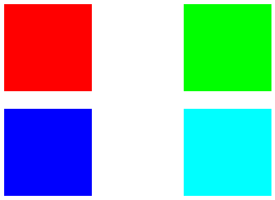
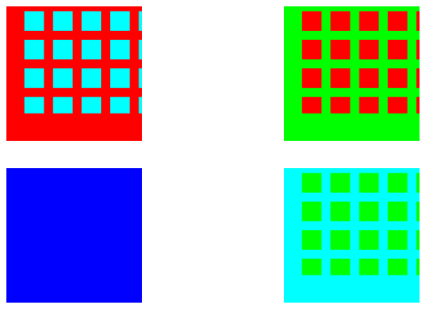

# GridMixup
A GridMixup augmentation, inspired by GridMask and CutMix

##  Easy install
`pip install git+https://github.com/IlyaDobrynin/GridMixup.git`

## Overview
This simple augmentation is inspired by the [GridMask](https://arxiv.org/abs/2001.04086) and [CutMix](https://arxiv.org/abs/1905.04899) augmentations.
The combination of this two augmentations forms proposed method.

### Example
To run simple examples notebooks, you should install requirements:
```
pip install -r requirements.txt
```
Simple examples are here: [demo](examples/demo.ipynb) and [pipeline demo](examples/simple_train_demo.ipynb)

TlDr:
```
from gridmix import GridMixupLoss

gridmix_cls = GridMixupLoss(
    alpha=(0.4, 0.7),
    hole_aspect_ratio=1.,
    crop_area_ratio=(0.5, 1),
    crop_aspect_ratio=(0.5, 2),
    n_holes_x=(2, 6)
)

images, targets = batch['images'], batch['targets']
images_mixed, targets_mixed = gridmix_cls.get_sample(images=images, targets=targets)
preds = model(images_mixed)
loss = criterion(preds, targets_mixed) 
```

**Before**<br>
<br>

**After**<br>


GridMixup loss defined as:

`lam * CrossEntropyLoss(preds, trues1) + (1 - lam) * CrossEntropyLoss(preds, trues2)`

where:
- `lam` - the area of the main image
- `(1 - lam)` - area of the secondary image 

### Parameters
GridMixupLoss takes follow arguments:
- `alpha` - parameter define area of the main image in mixed image. Could be `float` or `Tuple[float, float]`.
    - if `float`: lambda parameter gets from the beta-dictribution np.random.beta(alpha, alpha);
    - if `Tuple[float, float]`: lambda parameter gets from the uniform distribution np.random.uniform(alpha[0], alpha[1]).
- `n_holes_x` - number of holes in crop by X axis.
- `hole_aspect_ratio` - aspect ratio of holes.
- `crop_area_ratio` - parameter define area of the secondary image on a mixed image.
- `crop_aspect_ratio` - aspect ratio of crop.